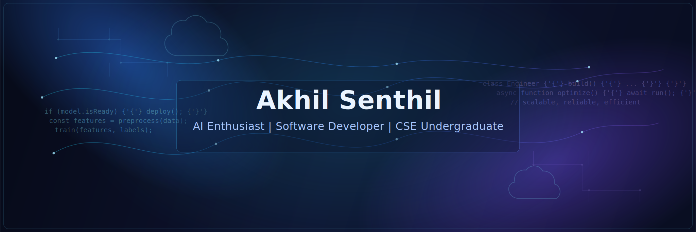

<p align="center">
  
</p>

<div align="center">

<!-- Custom Badges -->


</div>

<!-- Custom Divider -->
<div style="height: 3px; background: linear-gradient(90deg, #2563eb, #7c3aed, #0891b2); border-radius: 2px; margin: 20px 0;"></div>

<!-- ABOUT + CURRENT WORK side by side -->
<table width="100%">
<tr>
<td width="55%" valign="top">

## 🎓 About Me

Pursuing Computer Science Engineering at Amrita Vishwa Vidyapeetham with a passion for creating intelligent systems. My work focuses on the intersection of **artificial intelligence**, **software development**, and **embedded systems**. I specialize in building practical solutions that bridge theoretical concepts with real-world applications.

</td>
<td width="45%" valign="top">

## 🔧 Currently Working On

**Smart IoT Systems**
Developing Arduino-based solutions with sensor integration for real-time monitoring and automation.

**Machine Learning Applications**
Creating AI models for pattern recognition and predictive analysis in computational problems.

</td>
</tr>
</table>

<!-- Custom Divider -->
<div style="height: 3px; background: linear-gradient(90deg, #2563eb, #7c3aed, #0891b2); border-radius: 2px; margin: 20px 0;"></div>

## 📁 Projects Showcase

<table width="100%">
<tr>
<th>Project</th>
<th>Description</th>
<th>Status</th>
<th>Technologies</th>
</tr>
<tr>
<td><b>📍 GPS Tracking System</b></td>
<td>Real-time location monitoring using Arduino with integrated sensor networks for precise tracking.</td>
<td></td>
<td>Arduino · C · GPS · Sensors</td>
</tr>
<tr>
<td><b>🧠 AI Algorithm Development</b></td>
<td>Machine learning models for computational problem solving and pattern recognition.</td>
<td></td>
<td>Python · Scikit-learn · Algorithms</td>
</tr>
<tr>
<td><b>📊 MATLAB Simulation Suite</b></td>
<td>Comprehensive mathematical modeling and simulation environment for algorithm validation.</td>
<td></td>
<td>MATLAB · Simulation · Analysis</td>
</tr>
</table>

<!-- Custom Divider -->
<div style="height: 3px; background: linear-gradient(90deg, #2563eb, #7c3aed, #0891b2); border-radius: 2px; margin: 20px 0;"></div>

## 💻 Technical Skills

<div align="center">

<!-- Programming Languages -->
<h3>Programming Languages</h3>


<!-- Web Technologies -->
<h3>Web Development</h3>


<!-- Tools & Platforms -->
<h3>Tools & Platforms</h3>


</div>

<!-- Custom Divider -->
<div style="height: 3px; background: linear-gradient(90deg, #2563eb, #7c3aed, #0891b2); border-radius: 2px; margin: 20px 0;"></div>

## 📚 Learning Journey

<details>
<summary><b>📚 Current Studies & Interests</b></summary>
<br/>

| Area | Focus | Progress |
|------|-------|----------|
| **Machine Learning** | Neural networks and deep learning | 🟢 Active |
| **Embedded Systems** | IoT and microcontroller programming | 🟢 Active |
| **Data Structures** | Algorithms and optimization | 🟡 In Progress |
| **Web Development** | Full-stack application building | 🟢 Completed |

**Current Learning Goals:**
- Advanced AI algorithms and neural network architectures
- Real-time embedded system design
- Cloud computing and distributed systems
- Software architecture and design patterns

</details>

<!-- Custom Divider -->
<div style="height: 3px; background: linear-gradient(90deg, #2563eb, #7c3aed, #0891b2); border-radius: 2px; margin: 20px 0;"></div>

## 📊 GitHub Analytics

<div align="center">

<!-- GitHub Stats -->


</div>

<div align="center">
<!-- GitHub Streak -->

</div>

<div align="center">
<!-- Activity Graph -->

</div>

<!-- Custom Divider -->
<div style="height: 3px; background: linear-gradient(90deg, #2563eb, #7c3aed, #0891b2); border-radius: 2px; margin: 20px 0;"></div>

## 🎯 Career Aspirations

```
🎯 Short-term Goals
├── Master AI algorithms and neural networks
├── Complete advanced embedded systems projects
└── Build a portfolio of practical applications

🚀 Mid-term Vision
├── Strong foundation in software architecture
├── Contribute to meaningful open-source projects
└── Gain industry experience through internships

🌟 Long-term Ambition
├── Career in AI-driven software engineering
├── Work on cutting-edge technology solutions
└── Make impactful contributions to the field
```

**Core Philosophy:** *Depth over breadth. Systems over trends. Build solutions that create real value.*

<!-- Custom Divider -->
<div style="height: 3px; background: linear-gradient(90deg, #2563eb, #7c3aed, #0891b2); border-radius: 2px; margin: 20px 0;"></div>

## 🤝 Let's Connect

<div align="center">

<!-- Social Media Badges -->
<a href="https://www.linkedin.com/in/akhil-senthil-430b6a317">
  
</a>
<a href="https://github.com/Akhils696">
  
</a>
<a href="https://www.hackerrank.com/akhilsenthil696">
  
</a>
<a href="https://leetcode.com/AKHIL_S_696">
  
</a>
<a href="https://instagram.com/_akxil_s_">
  
</a>

<br/><br/>

### 📧 Contact Information

| Platform | Handle |
|----------|--------|
| **📧 Email** | akhilsenthil696@gmail.com |
| **💼 LinkedIn** | linkedin.com/in/akhil-senthil-430b6a317 |
| **💻 GitHub** | github.com/Akhils696 |
| **🏆 HackerRank** | hackerrank.com/akhilsenthil696 |
| **📊 LeetCode** | leetcode.com/AKHIL_S_696 |
| **📸 Instagram** | @_akxil_s_ |

</div>

<div align="center" style="margin-top: 30px; padding: 20px; background: linear-gradient(135deg, #0a192f, #112240); border-radius: 15px;">

### 💡 Open to Collaborations
I'm always excited to work on interesting projects, discuss AI and software development concepts, and collaborate on innovative solutions. Feel free to reach out!

</div>
